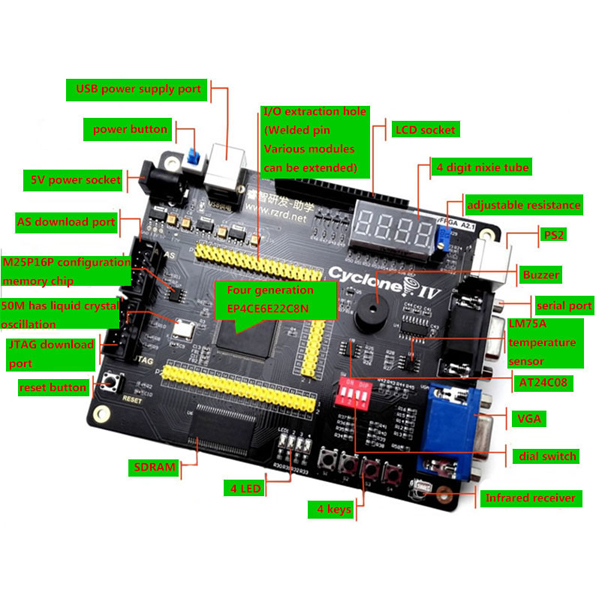

# MIPS CPU

This repository contains the implementation of a MIPS CPU based on the lab 
manual. 
Please note that this CPU is intended for practical exam purposes and is 
primarily designed for educational use.

Due to the nature of its purpose, this CPU lacks certain advanced features, 
such as pointers, that are not included in the lab manual.

## How did I use it

To use this implementation, I followed the steps below:

1. Tested the code using GHDL.
2. Used an FPGA Development Board, was ALTERA IV, and synthesized the code using Intel Quartus Lite free software.
3. I used an external breadboard to control the clock and get outputs. However, it is recommended to use the peripherals built-in to your kit for a more reliable and hassle-free experience.

## Future Development

I am actively working on a complete design based on modern MIPS architectures. 
This updated design will incorporate the missing features and provide a more 
comprehensive CPU implementation.

## License

This design is licensed under the GNU General Public License v3. 
You are free to edit, distribute, and modify it in accordance with the terms of the GPL3 license.
